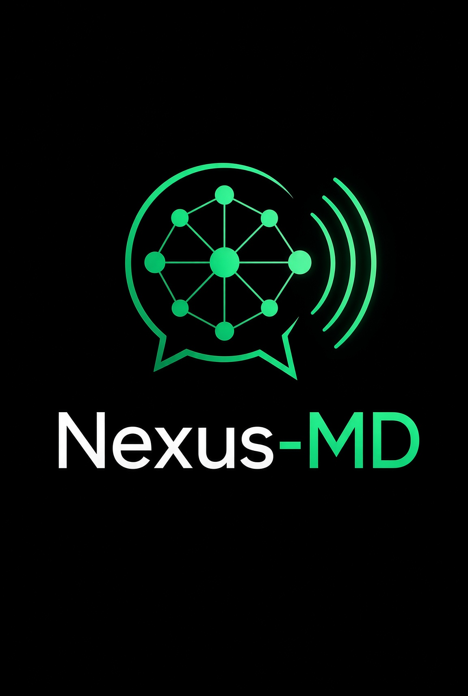

<p align="center">
  
</p>

<h1 align="center">Nexus-MD</h1>

<p align="center">
  A WhatsApp bot with a brain — AI chat, vision, voice, downloads and group tools.
</p>

<p align="center">
  <a href="https://nexus-md.duckdns.org/app"><b>➤ Deploy your bot</b></a>
  &nbsp;·&nbsp;
  <a href="https://nexus-md.duckdns.org/">Website</a>
  &nbsp;·&nbsp;
  <a href="#commands">Commands</a>
  &nbsp;·&nbsp;
  <a href="#self-hosting">Self-host</a>
</p>

---

## Get started

**1. Deploy** — open [Nexus Hosting](https://nexus-md.duckdns.org/app), create a bot, add your AI key.
A free [Groq key](https://console.groq.com/keys) is enough to run everything.

**2. Link WhatsApp** — open your bot's panel and scan the QR, or enter a pairing code.
The QR never leaves your bot; nothing is stored on any third-party server.

**3. Done** — Nexus messages you a connected card and your portable session string.
Send `.menu` to see what it can do.

> Keep the session string private — it *is* your WhatsApp login. Set it as `SESSION_ID`
> to move your bot to another host without linking again. It stops working the moment
> you unlink Nexus from **WhatsApp → Linked devices**.

## Features

- **AI** — chat, vision, speech-to-text and code help through any OpenAI-compatible
  provider (Groq, OpenRouter, OpenAI, local Ollama) or Claude. Configure a fallback
  and the bot fails over automatically instead of going silent.
- **Voice** — free Edge Neural TTS, with offline Piper baked in as a fallback. Nexus
  can hear voice notes and reply with its own.
- **Media** — stickers, image and video tools, logo rendering, background removal.
- **Downloads** — YouTube via yt-dlp; TikTok, Instagram and X through a self-hosted
  Cobalt instance.
- **Groups** — welcome/goodbye, antilink, antibot, antiword, antifake, warnings,
  member tools, scheduled quiet hours.
- **Automation** — scheduled messages, keyword filters, AFK, birthdays, auto-status.

## Commands

Default prefix `.` — change it with `.setprefix`. Send `.menu` for the full list.

| | |
|---|---|
| `.menu` | every command, by category |
| `.nexus <question>` | ask the AI anything |
| `.play <song>` | download audio from YouTube |
| `.sticker` | turn a replied image or video into a sticker |
| `.add` `.kick` `.mute` `.invite` | group administration |
| `.setcmd <name>` | turn any replied media into your own command |
| `.alive` `.health` | status and diagnostics |

Around 180 commands across `nexus` · `ai` · `tools` · `group` · `owner` · `media` ·
`downloader` · `fun` · `automation` · `whatsapp` · `system`.

## Self-hosting

Only needed if you'd rather not use the hosted platform. Docker is the supported path —
the image bundles ffmpeg, yt-dlp, Piper voices and everything else.

```bash
git clone https://github.com/ChristianNimb/nexus-md.git
cd nexus-md
cp .env.example .env
cp cookies.txt.example cookies.txt
docker compose up -d --build
```

Set `NEXUS_API_KEY` in `.env`, then watch for the QR:

```bash
docker compose logs -f nexus
```

Or open <http://localhost:3000/link> for the browser panel.

### Without Docker

Node 20+, with `ffmpeg` and `yt-dlp` on your `PATH`.

```bash
npm install
cp .env.example .env
npm start
```

To keep it running after you close the terminal, and bring it back if it
crashes:

```bash
npm install -g pm2
npm run pm2
```

| Script | Purpose |
| --- | --- |
| `npm start` | run in the foreground |
| `npm run pm2` | run under PM2, restarting on crash |
| `npm run stop` | stop the PM2 process |

## Configuration

Every option is documented in [`.env.example`](.env.example). The ones that matter:

| Variable | Meaning |
| --- | --- |
| `NEXUS_API_KEY` | your AI provider key — the only required setting |
| `PREFIX` | command prefix, e.g. `.` |
| `MODE` | `public` or `private` |
| `OWNERS` | extra owner numbers, country code, no `+` |
| `NEXUS_WEB_PASSWORD` | gate for the link panel — set before exposing port 3000 |
| `SESSION_ID` | portable session, to move hosts without re-linking |

## Security

- `.env`, `cookies.txt` and `session/` are gitignored and must stay that way.
  `session/` is your WhatsApp login — anyone with it can act as your account.
- Set `NEXUS_WEB_PASSWORD` and put TLS in front before exposing the panel.
- Running a bot on your personal number carries a ban risk. WhatsApp does not permit
  unofficial clients; use an account you can afford to lose.

